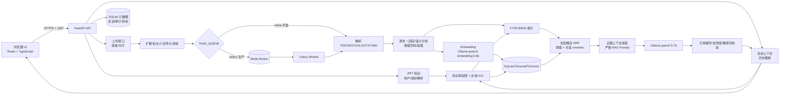
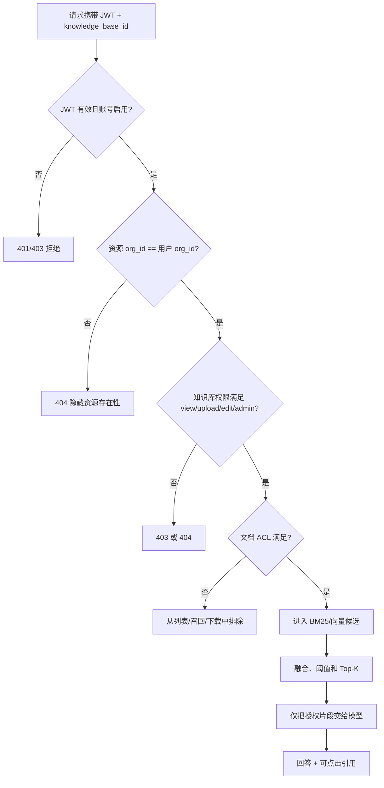
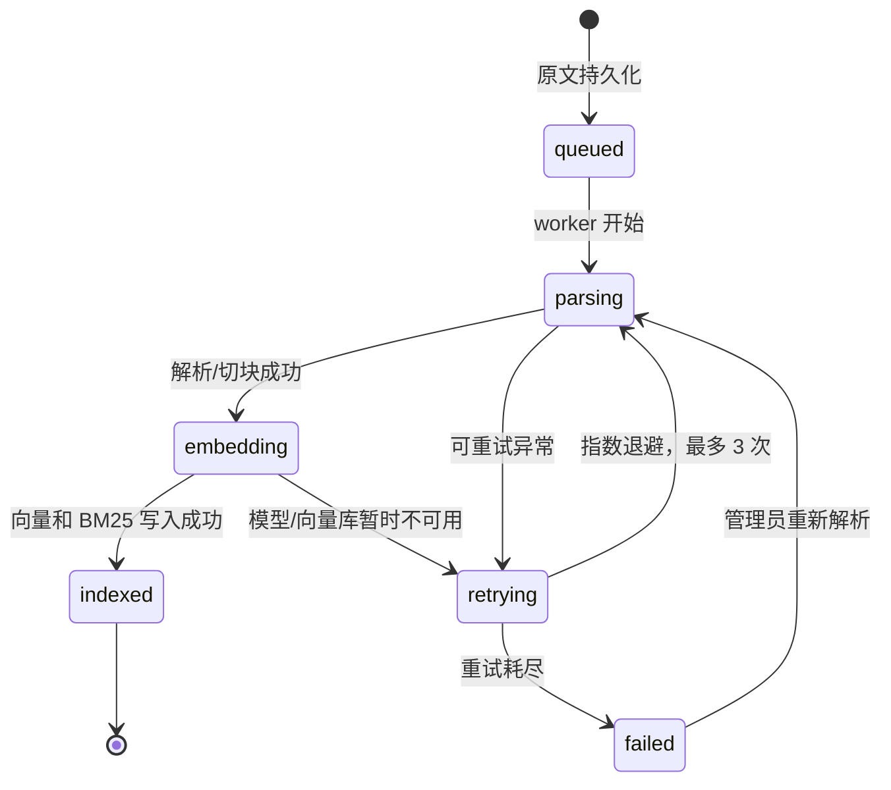

# 知域-企业私有 RAG 知识库架构

## 技术边界

后端实际由 FastAPI 提供，JWT 负责身份认证；检索层包含 SQLite FTS5 BM25、文件向量和 PGVector 适配器；上传任务支持本地 `inline` 与 Celery + Redis；生成模型是 Ollama `qwen2.5:7b`。当前仓库前端实际为 React + TypeScript + Vite，Vue3 不是已落地实现。若 Vue3 是硬性验收条件，应先迁移前端并重新执行全套测试。

## 整体请求流程

会话管理作为问答链路的持久化旁路，保存标题、收藏状态、父会话分支和反馈原因。分享只保存随机 token 的 SHA-256 摘要，带有效期和可选访问密码；公开读取接口仅返回创建者已经生成的会话内容，不提供知识库检索能力。

核心顺序必须是：`身份认证 -> 组织隔离 -> 知识库权限 -> 文档 ACL -> 召回 -> 模型`。前端隐藏按钮不是安全边界。

## RBAC 与文档 ACL

### 组织角色

| 角色 | 组织级能力 |
| --- | --- |
| `admin` | 管理用户、用户组、知识库、RAG 参数、审计和索引 |
| `editor` | 能否写入仍取决于知识库授权；默认不是所有库可编辑 |
| `viewer` | 能否读取和问答仍取决于知识库授权 |

### 知识库权限

| 权限 | 允许操作 |
| --- | --- |
| `view` | 列表、下载、检索、引用 |
| `upload` | 只能上传；不能读取列表、下载或问答 |
| `edit` | `view` + 上传、重解析、修改文档 ACL、版本切换、删除 |
| `admin` | `edit` + 知识库生命周期和成员授权 |

### 文档可见性

- `organization`：同一组织且通过知识库权限的成员可见。
- `restricted`：组织管理员、所有者、被指定用户或共享授权用户组成员可见。
- `private`：组织管理员和所有者可见。

所有文档、下载、引用片段和向量候选都必须应用同一套 ACL。无权资源统一返回 404，减少 ID 枚举泄漏。

## Celery 异步任务

生产 Compose 将 `TASK_QUEUE=celery`，API 保存原文和文档元数据后立即返回 `document_id` 与 `task_id`。前端轮询 `GET /api/documents/{id}/status`，显示以下阶段：

任务配置了超时、晚确认和 worker 丢失重投；重试耗尽会写入 `task_dead_letters`，管理员可通过 `/api/admin/tasks/dead-letters` 查询。当前仍缺跨副本幂等键、告警编排和真正的 Redis 集群高可用。

## 数据存储与隔离

- 元数据、会话、审计和 BM25：当前使用 SQLite WAL，适合单机演示。
- SQLite 向量：保存 chunk 的 JSON 向量，检索最多扫描 5000 个授权片段，适合开发验证。
- Chroma：按组织/知识库派生 collection，适合开发环境。
- PGVector：通过 `org_id`、`knowledge_base_id` 和授权文档 ID 过滤，是逻辑隔离；不是每租户独立数据库。
- 原文：当前保存于本地目录；生产应迁移到加密对象存储并设置生命周期。

跨数据库和向量库没有分布式事务。写入中断后可能需要管理员重建索引，这是已知一致性边界。

## 可观测与恢复

`/metrics` 暴露 HTTP、模型和检索请求计数及耗时。SQLite/文件备份使用 `scripts/backup.py`，恢复使用 `scripts/restore.py`。PGVector 部署还必须配套 `pg_dump`、对象存储备份、Redis 任务记录备份和恢复演练。
