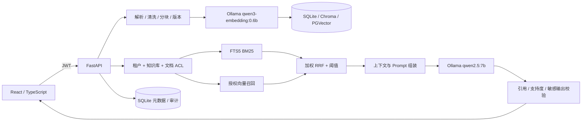

# llm-rag-knowledge-base

## 知域-企业私有 RAG 知识库

面向企业内部员工的私有 RAG 知识库，支持知识库空间、多格式文档、混合检索、引用溯源、多轮会话、细粒度权限、审计、评估和本地模型。后端为 FastAPI，JWT 负责鉴权；生成模型使用本地 Ollama `qwen2.5:7b`，Embedding 使用 `qwen3-embedding:0.6b`。

> 技术栈核验说明：当前仓库前端实际是 React + TypeScript，不是 Vue3；开发默认使用 SQLite 向量模式，Compose 提供 PGVector；本地默认同步处理，Compose 可切换 Celery + Redis。下面将代码已验证能力与生产路径分开列出，避免公开仓库把“目标栈”误写成“已落地栈”。

| 层次 | 当前仓库可验证实现 | 生产/目标路径 |
| --- | --- | --- |
| 前端 | React + TypeScript + Vite | 若 Vue3 是硬性要求，需要单独迁移并补回归 |
| API | FastAPI + JWT | 可接入企业 OIDC/SAML 和 MFA |
| 检索 | FTS5 BM25 + 余弦向量 + RRF | PGVector 适配器已提供，Compose 未实机验证 |
| 任务 | `inline` 本地模式 | `Celery + Redis` Compose 模式，未在当前机器实机验证 |
| 模型 | Ollama `qwen2.5:7b` + `qwen3-embedding:0.6b` | 可替换为受控远程模型服务 |

## 验收状态

截至 2026-08-28：

| 范围 | 状态 | 证据与边界 |
| --- | --- | --- |
| 后端与权限回归 | 本机已验证 | `30 passed`；覆盖租户、知识库、仅上传、文档 ACL、版本、XLSX、分片上传、会话、反馈、死信权限、文件头和指标路径 |
| 前端生产构建 | 本机已验证 | TypeScript 检查和 Vite 构建通过 |
| 本地生成模型 | 本机已验证 | Ollama `qwen2.5:7b`；真实问答评估曾运行 |
| 本地 Embedding | 本机已验证 | `qwen3-embedding:0.6b`，实测 1024 维 |
| SQLite 混合检索 | 本机已验证 | FTS5 BM25 + 余弦向量 + 加权 RRF，ACL 在召回前执行 |
| Chroma / PGVector | 代码已接入，服务未实测 | 提供真实读写适配器；当前机器没有 Docker，不能声称容器和数据库已验证 |
| Docker Compose | 制品已提供，未实跑 | 编排应用、PGVector、Ollama 和模型初始化 |
| 本地演示环境 | 本机已验证 | `http://127.0.0.1:8080`；账号、流程和数据边界见 [演示说明](DEMO.md) |
| 公网演示 | 未提供 | 没有云主机、域名、TLS 或部署凭据；localhost 不是云演示 |
| 生产就绪 | 未达到 | 仍缺 SSO/MFA、恶意文件扫描、OCR、解析沙箱、分布式限流、监控告警、备份演练和元数据数据库迁移 |

“能独立完成前端、后端、模型接入、RAG、评估和部署”只能由可复现制品和测试支撑，不是生产认证。本项目能演示完整链路，但没有经过容量、渗透、容灾或合规验收。

## 功能

- PDF、DOCX、TXT、Markdown、XLSX 上传；大于 8 MiB 时前端自动走顺序分片上传，服务端总上限可配置。
- PDF 页码、DOCX 段落/表格、XLSX 工作表/行号溯源；空白或扫描 PDF 明确提示缺少 OCR。
- 固定大小和语义段落两种切块，大小与重叠度可配置；清理脏换行和特殊控制字符。
- 文档标签、处理状态、错误原因、重新解析、同组多版本、当前版本切换与旧版本归档。
- 本地 Ollama 或 OpenAI 兼容远程模型；SQLite、Chroma、PGVector 三种向量模式。
- BM25 与向量召回、权重融合、Top K 和相似度阈值；无证据时严格拒答。
- 多轮会话、上下文截断、历史恢复、Markdown 导出、点赞/点踩。
- 引用文档、文件名、页码/段落、原文片段；点击引用后再次执行接口 ACL。
- 组织管理员、知识库管理员、普通成员；知识库级 `view/upload/edit/admin` 权限。
- 文档级全组织、私有、指定用户组或指定用户；列表、下载、引用与检索共用后端 ACL。
- 用户创建/停用、用户组、知识库授权、审计日志、RAG 与安全参数管理。
- 上传处理阶段：队列、解析、向量化、失败原因和任务 ID；本地默认同步，Compose 默认 Celery + Redis 异步。
- Prometheus 文本指标：`/metrics` 暴露 HTTP、模型、检索耗时和请求计数。

## UI 截图占位

以下位置预留给后续替换的本地截图。截图应使用脱敏演示数据，不要包含企业真实文档、账号密码、JWT 或内部域名。

| 页面 | 截图占位路径 | 建议展示内容 |
| --- | --- | --- |
| 登录与知识库总览 | `docs/assets/login-and-overview.png` | 登录、知识库列表、当前用户角色 |
| 文档处理状态 | `docs/assets/document-processing.png` | 待解析、解析中、向量化中、已索引、失败原因 |
| 问答引用 | `docs/assets/chat-citations.png` | 多轮会话、引用文档、页码和片段 |
| 权限与审计 | `docs/assets/rbac-audit.png` | 知识库授权、文档 ACL、审计日志 |

> 截图替换方式：将对应 PNG 放入 `docs/assets/`，保持表格中的文件名；当前仓库只保留占位说明，不把本机截图当作产品承诺。

## 架构



权限顺序必须是 `身份 -> 知识库授权 -> 文档 ACL -> 候选召回 -> 模型`。前端隐藏按钮不构成安全控制。完整数据边界和部署图见 [架构说明](ARCHITECTURE.md)。

## 文档导航

| 文档 | 内容 |
| --- | --- |
| [ARCHITECTURE.md](ARCHITECTURE.md) | Mermaid 整体架构、RBAC、文档 ACL、Celery 流程和数据边界 |
| [TEST_PLAN.md](TEST_PLAN.md) | 功能、边界、安全、故障测试矩阵及未覆盖风险 |
| [DEMO.md](DEMO.md) | Docker Compose、本地演示账号、完整操作流程和数据安全提醒 |
| [docs/cost-estimate.md](docs/cost-estimate.md) | 本地/云资源与 Embedding、LLM 推理成本测算 |
| [docs/safety-failure.md](docs/safety-failure.md) | 幻觉抑制、安全控制和失败降级策略 |
| [docs/EVALUATION.md](docs/EVALUATION.md) | RAG 评估指标、运行器和偏差边界 |

## 环境依赖

- Python 3.12（本机当前虚拟环境为更新版本也已通过测试）
- Node.js 20+ 和 npm
- Ollama，以及 `qwen2.5:7b`、`qwen3-embedding:0.6b`
- 可选：Docker Desktop / Docker Engine + Compose
- 可选向量驱动：`backend/requirements-vector.txt`

最低 16 GiB 内存是单用户 CPU 演示的经验下限，不是并发容量承诺。GPU 可选；CPU 可运行量化 7B 模型，但延迟取决于 CPU、内存带宽、上下文长度和并发。生产容量必须压测，不能从“能启动”推导“4 核 16G 足够生产”。

## 本地快速启动

前置依赖：Python 3.10+、Node.js 20.19+ 或 22.12+。使用真实本地模型时，还需先启动 Ollama，并准备 `qwen2.5:7b` 和 `qwen3-embedding:0.6b`：

```powershell
ollama pull qwen2.5:7b
ollama pull qwen3-embedding:0.6b
```

### Windows 一键启动

直接双击根目录的 `start.bat`，或在 PowerShell 中执行：

```powershell
.\start.bat
```

### Linux / macOS 一键启动

```bash
chmod +x start.sh
./start.sh
```

脚本会自动检查 Python 和 Node.js、在根目录创建 `venv/`、从缺失的 `.env.example` 生成 `.env`、安装 `backend/requirements.txt` 与前端依赖、构建前端，然后依次启动 FastAPI 和 Vite。启动成功后会自动打开 [http://localhost:8080](http://localhost:8080)。开发服务器地址为 `http://localhost:5173`，其 API 显式指向 8080 后端。

若 8080 或 5173 已被占用，脚本会停止并给出中文错误。按 `Ctrl+C` 或关闭启动终端会同时清理前后端进程；单独关闭浏览器标签页不会结束服务，因为脚本无法安全区分该标签页和用户已有的浏览器进程。

OpenAPI：[http://localhost:8080/docs](http://localhost:8080/docs)。可用 `.\scripts\smoke.ps1` 做无破坏性冒烟检查；它只验证健康检查、登录、分页文档和 `/metrics`。

需要手动启动或跳过重复构建时，仍可使用：

```powershell
.\scripts\start-local.ps1 -SkipBuild
```

演示账号仅在 `DEMO_MODE=true` 且数据库初始化时使用：

| 身份 | 用户名 | 密码 |
| --- | --- | --- |
| 组织管理员 | `admin` | `admin123` |
| 研发成员 | `engineer` | `engineer123` |
| 财务成员 | `finance` | `finance123` |
| 另一租户管理员 | `otheradmin` | `other123` |

固定密码只适合本地演示。`APP_ENV=production` 时程序会拒绝弱 JWT 密钥或开启演示数据。

## Docker Compose

```powershell
docker compose up --build
```

默认暴露 `localhost:8080`，并启动 PGVector、Ollama、模型下载初始化和应用。首次拉取两个模型需要约 5 GiB 网络与磁盘空间，实际数字随模型版本变化。当前开发机没有 Docker，这条路径尚未实跑；部署前必须执行镜像构建、模型拉取、健康检查和持久卷恢复测试。

Compose 同时启动 Redis 和 Celery worker。API 使用 `TASK_QUEUE=celery`，上传原文落盘后立即返回，文档列表轮询 `processing_stage`（`queued`、`parsing`、`embedding`、`indexed` 或 `failed`）。本地脚本默认 `TASK_QUEUE=inline`，不要求 Redis。Celery 的超时、重试和 worker 丢失重投已配置，但死信告警、幂等键和断点恢复仍需按企业运维平台补齐。

Compose 没有加入 MySQL。原因不是遗漏：当前元数据和审计代码使用 SQLite 事务，加入一个未被应用读取的 MySQL 容器会制造错误的架构声明。多副本生产部署应先将元数据层正式迁移到 PostgreSQL/MySQL、补迁移工具和一致性测试，再加入编排。

## 配置

复制并修改 `.env.example`。关键配置：

| 变量 | 默认 | 说明 |
| --- | --- | --- |
| `OLLAMA_BASE_URL` | `http://127.0.0.1:11434` | 本地 Ollama 地址 |
| `LLM_MODEL` | `qwen2.5:7b` | 生成模型 |
| `EMBEDDING_MODEL` | `qwen3-embedding:0.6b` | Embedding 模型 |
| `VECTOR_STORE` | `sqlite` | `sqlite` / `chroma` / `pgvector` |
| `CHROMA_PATH` | `backend/data/chroma` | Chroma 开发目录 |
| `PGVECTOR_DSN` | 本地 PostgreSQL DSN | PGVector 连接串 |
| `PGVECTOR_DIMENSIONS` | `1024` | 必须与 Embedding 实际维度一致 |
| `MAX_UPLOAD_BYTES` | `20971520` | 直接上传上限，bytes |
| `MAX_CHUNKED_UPLOAD_BYTES` | `536870912` | 分片上传总上限，bytes |
| `MODEL_TIMEOUT_SECONDS` | `90` | 单次模型请求超时 |
| `TASK_QUEUE` | `inline` | `inline` 本地同步；`celery` 使用 Redis 后台索引 |
| `CELERY_BROKER_URL` | `redis://127.0.0.1:6379/0` | Celery broker |
| `CELERY_RESULT_BACKEND` | `redis://127.0.0.1:6379/1` | 任务结果存储 |
| `TASK_TIMEOUT_SECONDS` | `900` | 单个索引任务超时 |
| `RATE_LIMIT_ENABLED` | `true` | API 进程内滑动窗口；多副本应交给网关/Redis |
| `RATE_LIMIT_PER_MINUTE` | `600` | 每个令牌/IP 每分钟基础额度 |
| `RATE_LIMIT_BURST` | `50` | 突发额度 |
| `AUDIT_LOG_QUERIES` | `false` | 是否保存问题原文；开启有隐私风险 |

管理员可在“权限与审计 -> RAG 与安全参数”修改切块、Top K、两路权重、相似度阈值、temperature、上下文、系统 Prompt、严格 RAG、注入过滤和敏感词。改变 Embedding 模型后必须重建索引。

## API

主要接口前缀：

- `/api/auth`：登录与当前用户
- `/api/knowledge-bases`：知识库生命周期和成员权限
- `/api/documents`：上传、列表、权限、版本、解析、下载和引用片段
- `/api/uploads`：分片上传会话
- `/api/chat`：知识库绑定的多轮 RAG
- `/api/conversations`：历史、反馈、导出和删除
- `/api/admin`：成员、用户组、审计、RAG 参数、模型、索引状态和 Celery 死信任务

精确请求/响应模型以 `/docs` 为准。

列表接口采用后端分页，避免前端一次性读取全量记录。`/api/documents`、`/api/knowledge-bases`、`/api/conversations`、`/api/admin/users`、`/api/admin/groups`、`/api/admin/audit` 以及权限/版本列表支持 `page`（默认 `1`）和 `page_size`（默认 `20`，最大 `100`）；文档还支持 `q`、`visibility`，知识库、成员和审计支持 `q`。响应体仍是数组，分页信息通过 `X-Total-Count`、`X-Page`、`X-Page-Size`、`X-Total-Pages` 响应头返回。前端表格只请求当前页，知识库选择器和上传权限选项会按页汇总可访问项。

## 测试与评估

```powershell
cd backend
..\.venv\Scripts\python.exe -m pytest -q
cd ..
npm run build --prefix frontend
.\.venv\Scripts\python.exe evaluation\run.py `
  --base-url http://127.0.0.1:8080 `
  --output artifacts\evaluation\latest.json
```

自动化测试覆盖：基础 RAG 与引用、无资料拒答、跨租户/跨知识库/文档 ACL、大文件分片、损坏/空白 PDF、Office 文件头、XLSX 表格、模型故障、多轮会话、版本切换、反馈、安全设置、分页和 Prometheus 指标。逐项验收矩阵见 [测试计划](TEST_PLAN.md)。评估集只有 8 条演示用例，结果不能外推生产。指标、偏差和历史报告见 [评估方案](docs/EVALUATION.md) 与 [评估报告](docs/EVALUATION_REPORT.md)。

## 幻觉、安全和失败处理

- 低于相关性阈值时严格拒答，不把空上下文交给模型自由补答。
- 系统 Prompt 要求证据内回答；引用编号、段落覆盖、词项支持和拉丁实体做启发式校验。
- 校验失败或生成服务失败时返回带引用的抽取式降级答案。
- Embedding 故障时降级到 BM25；界面显示降级状态。ACL/数据库失败则失败关闭，不开放访问。
- 输入拦截常见 Prompt 注入模式，输出替换可配置敏感词；两者都是启发式控制，不能替代红队和内容审核。
- 白名单限制扩展名并校验 PDF/Office 文件头，扫描 PDF 提示缺少 OCR；尚无杀毒、解析沙箱和压缩炸弹防护。
- 解析失败保留错误状态，可重新解析；外部向量库失败返回友好的 503，不向前端暴露堆栈。

详细威胁边界和未完成控制见 [幻觉、安全与失败场景](docs/safety-failure.md)。

## 成本

本地模型没有外部 token 账单，但成本不为零。已测模型文件合计约 4.96 GiB；还需计算内存/显存、电力、硬件折旧、向量与原文存储、备份、监控、安全和运维工时。云主机“4 核 16G”只能视为低并发试运行假设，不是生产推荐值。计算公式与已核实数据见 [成本说明](docs/cost-estimate.md)。

## 已知限制

- 扫描图片 PDF 需要另接 OCR；当前只识别并提示空白/扫描风险。
- 本地 `TASK_QUEUE=inline` 时解析和向量化在请求内执行；生产 Compose 使用 Celery + Redis 异步，但尚无服务端断点续处理和死信告警。
- SQLite 向量模式最多扫描 5000 个授权片段，适合开发验证，不适合大规模数据。
- Chroma 为每个租户/知识库独立 collection；PGVector 使用租户和知识库列做逻辑隔离，不是数据库级物理隔离。
- 文档版本缺少“生效日期/废止日期/冲突优先级”，互相冲突的制度仍需人工治理。
- 没有云演示；云上演示必须使用只读账号、TLS、独立演示数据，禁止上传真实企业资料。
- 未实现 SSO、MFA、不可变审计、对象存储、KMS、杀毒/解析沙箱、分布式限流和多副本元数据存储。已提供 SQLite/文件备份脚本和 `/metrics` 采集文本，但尚未完成 Prometheus/Alertmanager 接入与恢复演练。

## 备份与恢复

单机 SQLite 使用 `scripts/backup.py` 生成一致性备份（数据库、原始文件和 Chroma 目录）：

```powershell
.\.venv\Scripts\python.exe scripts\backup.py --output backups\20260828-demo
.\.venv\Scripts\python.exe scripts\restore.py backups\20260828-demo --force
```

恢复前必须停止应用；脚本会保留现有数据库和目录的时间戳副本。PGVector 生产环境必须同时执行 `pg_dump --format=custom`，并备份原文对象存储和 Redis/Celery 失败任务记录；恢复后应运行 `pytest`、健康检查、索引状态检查和一条带权限的引用问答。
