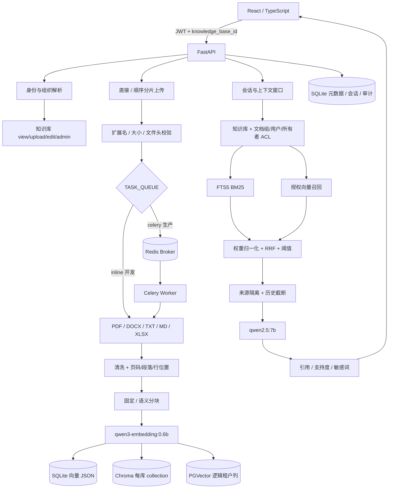
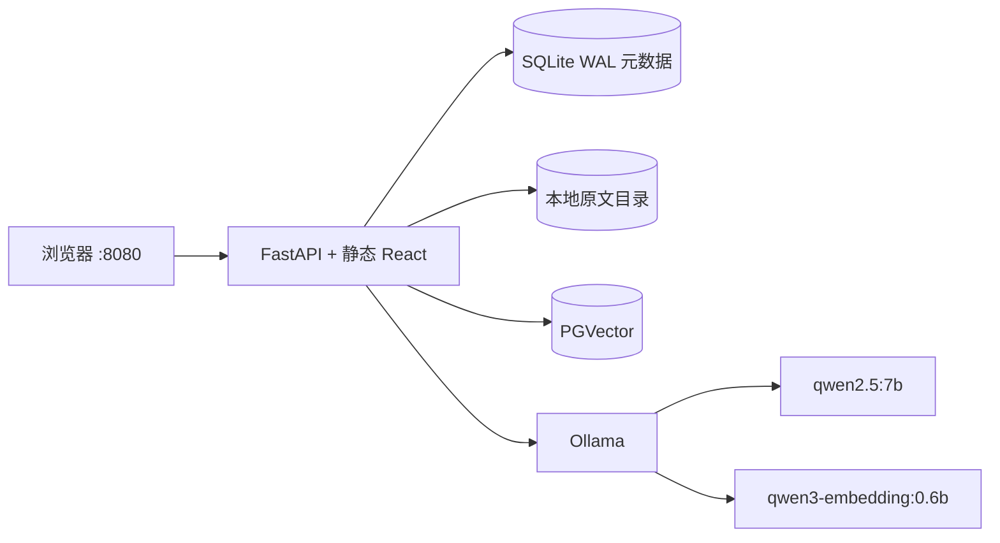

# 架构与数据边界

## 请求架构

最重要的安全顺序是 `身份 -> 组织 -> 知识库 -> 文档 ACL -> 候选 -> 模型`。没有知识库权限时，文档不会进入 BM25、向量召回或模型上下文。前端权限控件只提供操作入口；所有读取和修改仍由接口层校验。

## 单机与 Compose 部署

Compose 真正连接 PGVector 和 Ollama。关系元数据仍使用 SQLite，因此该拓扑只适合单应用副本；多个 FastAPI 副本共享 SQLite/本地原文会带来锁、文件一致性和调度问题。将未被代码使用的 MySQL 服务加入图中不构成生产能力。

生产化迁移建议：

1. 元数据、会话和审计迁移至受管 PostgreSQL/MySQL，并引入版本化迁移工具。
2. 原文迁移至带服务端加密和生命周期策略的对象存储。
3. 解析、Embedding、重建索引进入异步队列，设计幂等键、重试和死信队列。
4. API 才可扩为多副本，并补指标、链路、集中日志、密钥管理与备份恢复。

## 权限模型

### 组织角色

- `admin`：组织超级管理员，可管理本组织用户、用户组、参数、审计和所有知识库。
- `editor`：组织层编辑身份；实际知识库能力仍取决于知识库授权。
- `viewer`：组织普通成员；实际可见范围仍取决于知识库和文档授权。

### 知识库权限

`view` 和 `upload` 是独立能力，不是简单的高低等级；`edit` 与 `admin` 才包含完整读写能力：

| 权限 | 能力 |
| --- | --- |
| `view` | 查看文档、检索和引用，不能上传 |
| `upload` | 只能提交文档；列表为空，不能下载或检索 |
| `edit` | 查看、上传、修改文档权限、重解析、版本切换和删除 |
| `admin` | `edit` 的全部能力，以及知识库生命周期和成员授权 |

组织管理员始终按知识库 `admin` 处理。其他用户必须在 `knowledge_base_access` 中有显式记录。知识库归档后不出现在普通选择列表。

### 文档权限

文档首先必须属于已授权知识库，然后满足以下任一规则：

1. `visibility = organization`；
2. 当前用户是所有者；
3. `visibility = restricted` 且与授权用户组有交集；
4. `visibility = restricted` 且在指定用户列表中；
5. 组织管理员。

对无权文档、下载和引用片段统一返回 404，降低 ID 枚举信息泄漏。写接口再次要求知识库 `upload/edit/admin`，不能通过直接修改 ID 绕过。

## 向量存储边界

- `sqlite`：向量以 JSON 保存在 chunk 行，查询最多扫描 5000 个授权片段。开发简单，但近似线性复杂度。
- `chroma`：以 `SHA-256(org_id:knowledge_base_id)` 派生一个 collection，实现库级存储分离；文档 ID 过滤仍限制当前用户授权集合。
- `pgvector`：共享表包含 `org_id`、`knowledge_base_id`、`document_id`，查询同时过滤三者。它是逻辑隔离，不是每租户独立数据库。

SQLite 保留 chunk 正文、BM25 和向量元数据；外部向量库只保存向量与标识。重建索引按知识库同步外部库后，再更新 SQLite 中的模型版本。跨存储没有分布式事务，极端中断时可能需要再次执行重建，这是当前一致性限制。

每个片段记录 `embedding_model` 和维度。SQLite 检索只使用当前模型版本；管理员状态页显示过期片段和向量库健康状态。`PGVECTOR_DIMENSIONS` 必须与模型实际输出一致，本机 `qwen3-embedding:0.6b` 实测为 1024 维。

## 文档与会话流程

上传先检查大小和白名单，随后解析表格/文本并记录页码、段落或 XLSX 行位置。固定分块使用大小与重叠；语义分块优先按标题、段落和句子边界组合。同一文档的新版本继承版本组，只有 `is_current=1` 的版本参与检索。

`TASK_QUEUE=inline` 用于本地测试，上传请求会等待解析完成；Compose 默认使用 `TASK_QUEUE=celery`，API 在原文持久化后立即返回，Celery worker 负责解析、Embedding 和写索引。文档 `processing_stage` 会经历 `queued -> parsing -> embedding -> indexed`，失败进入 `failed` 并保存原因。Celery 配置了超时、晚确认、重试和 worker 丢失重投；Redis 不可用时任务不会假装成功，需由运维检查失败任务并重新解析。大文件分片只解决传输内存峰值，不等于处理完成。

上传文件同时做扩展名、大小和 PDF/Office 文件头校验。文件头校验不是病毒扫描或解析沙箱，生产仍需接入杀毒和隔离执行。

会话绑定用户和知识库。追问会把上一轮问题加入检索查询，并按 `max_history_messages` 和 `max_context_chars` 截断模型上下文。用户只能读取、导出、反馈和删除自己的会话。

## 检索与幻觉边界

BM25 和向量各取候选，按管理员配置的两路权重归一化后执行 RRF。相似度阈值只作用于向量候选；FTS 候选还要满足最小词项重合。每份文档最多进入两个片段，最终取 Top K。

真实向量阈值 `0.40` 来自当前小演示集：曾测相关约 `0.4595-0.7169`，不相关约 `0.1426-0.3341`。这是本数据集调参结果，不是模型通用常数。换文档、语言、切块或模型都必须重新评估。

回答后的引用编号、段落覆盖、关键词支持和拉丁实体检查是启发式证据，不是自然语言蕴含证明。它能捕获部分伪造引用，不能可靠识别否定、数字单位、过期制度或来源本身错误。
